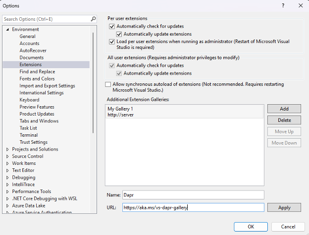
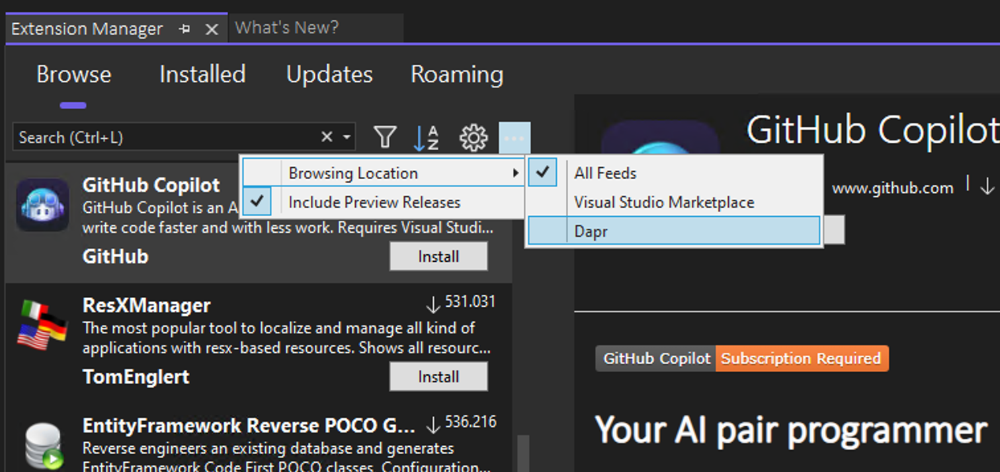
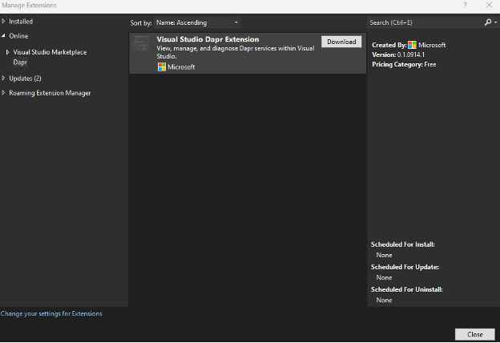
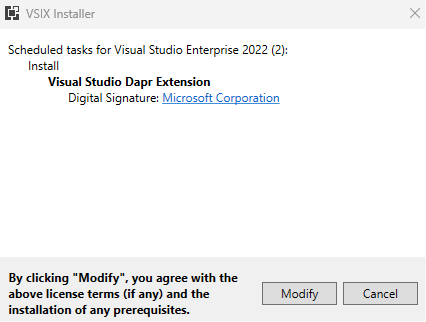
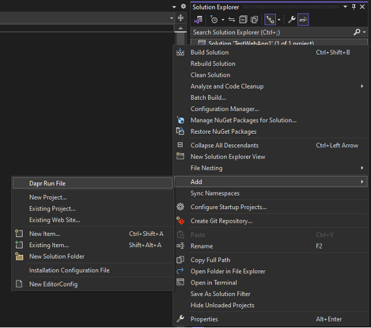
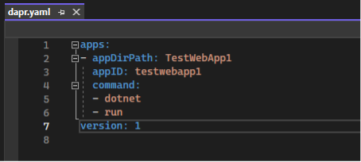
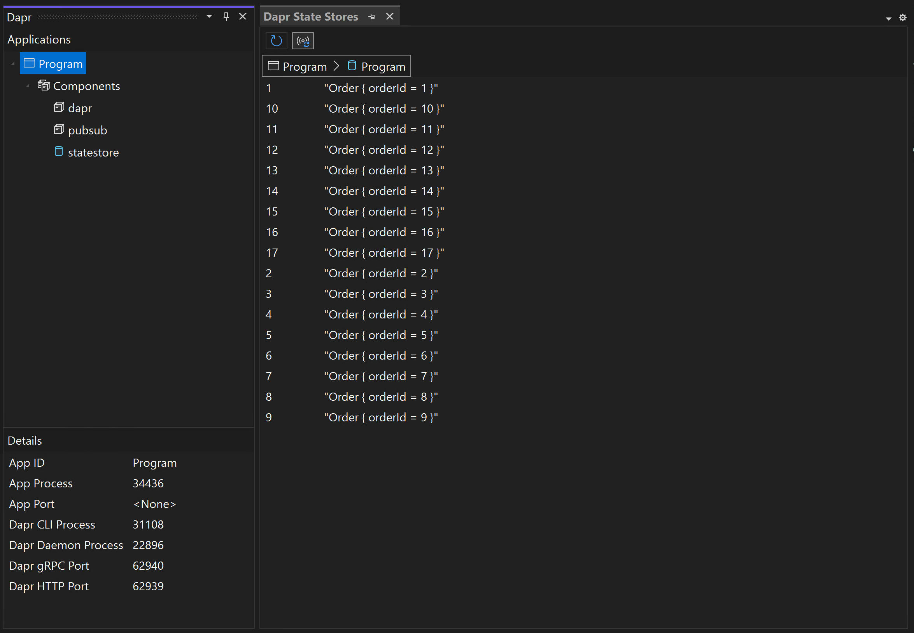
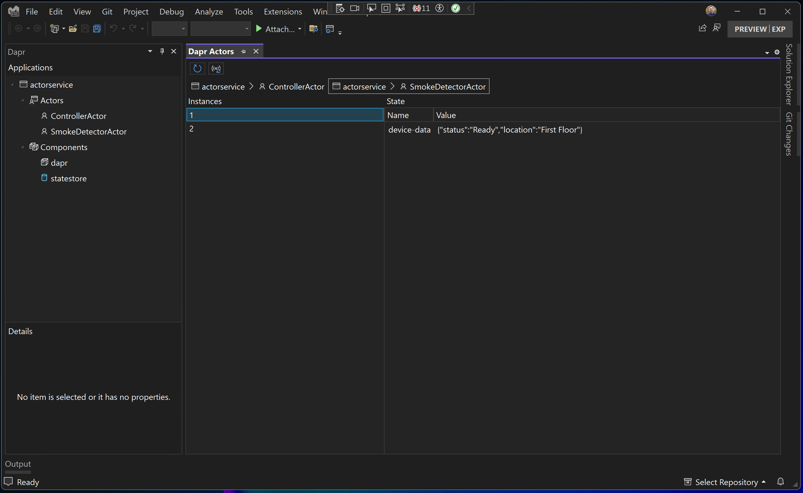

# Visual Studio Dapr Extension

 

The Dapr extension for Visual Studio enables you to view, manage, diagnose, and debug Dapr services within Visual Studio.

## Changelog

|Version|Update|
|-|-|
| 	0.1.109.3 (Preview)|Added tool window to monitor Dapr actor instances and state (preview).
|0.1.102.1 (Preview)|Initial marketplace release with Dapr run file orchestration, debugging, and Dapr tool window to monitor running Dapr applications and state store state (preview).|

## Prerequisites

* [Visual Studio 2022 17.9.0 Preview 2](https://learn.microsoft.com/en-us/visualstudio/releases/2022/release-notes-preview) [Community, Professional, or Enterprise] [ARM64 or AMD64]
* [Dapr 1.12 or later](https://dapr.io)

## Installation

### Visual Studio Marketplace

The extension can be downloaded and installed from the [Visual Studio Marketplace](https://marketplace.visualstudio.com/items?itemName=ms-azuretools.vs-dapr).

### Intermediate Builds

Intermediate builds are also available via an additional Visual Studio extension gallery.

> [!WARNING]
> Intermediate builds may contain incomplete features, are not extensively tested, may not meet your quality standards, and are intended for evaluation and feedback purposes. Use at your own risk.

To get started, add the gallery to Visual Studio:

1. From Visual Studio, select **Tools > Options**
1. In the Options window, select **Environment > Extensions**
1. Under **Additional Extensions Galleries**, click **Add**
1. Update the name and URL:

   * **Name:** Dapr
   * **Url:** https://aka.ms/vs-dapr-gallery

   

1. Click **Apply** to review the changes, and then **OK** to confirm and close the window
1. From Visual Studio, select **Extensions > Manage Extensions**
1. In the toolbar **...** menu, under **Browsing Location**, select the **Dapr** gallery you just created

   

1. Click **Install** to install the extension (once Visual Studio is closed)

   

1. Close all Visual Studio windows to start the installation
1. In the installation window, click **Modify** to finish installing

   

1. Once modifications are complete, click **Close** to close the installation window

## Use

### Starting with the Dapr Extension

1. Open your solution in Visual Studio
1. Right-click the solution in Solution Explorer and select **Add > Dapr Run File**

   

1. You can now edit and add to the created `dapr.yaml` file

   

### Preview Features

Enabling the Dapr run file debugging experience was the initial concern for the extension but there is considerable other feature work in progress. While not available by default, this work in progress can be enabled via feature flags.

#### Enabling Dapr Preview Features

1. Install [the Feature Flags extension](https://marketplace.visualstudio.com/items?itemName=PaulHarrington.FeatureFlagsPreview), which allows you to view and modify Visual Studio feature flags
1. Open **Tools > Options > Feature Flags**
1. Enable the desired Dapr feature flags
   - `Dapr.ToolWindows.Dapr`: Enables the new Dapr tool window

> [!WARNING]
> Preview features are not extensively tested, may not meet your quality standards, and are intended for evaluation and feedback purposes. Use at your own risk.

#### Dapr Tool Window

The Dapr tool window displays information about running Dapr applications, such as its loaded components and various ports, and will be familiar to users of the VS Code Dapr extension. It can be opened via the **View > Other Windows > Dapr** menu command.

For applications using a "default" state store (i.e. Redis), you can also open an additional Dapr State Stores tool window to show just the state for that application.

For applications using Dapr actors, you can also open an additional Dapr Actors tool window to show just the state for individual actor instances.

## Contributing

This project welcomes contributions and suggestions.  Most contributions require you to agree to a
Contributor License Agreement (CLA) declaring that you have the right to, and actually do, grant us
the rights to use your contribution. For details, visit https://cla.opensource.microsoft.com.

When you submit a pull request, a CLA bot will automatically determine whether you need to provide
a CLA and decorate the PR appropriately (e.g., status check, comment). Simply follow the instructions
provided by the bot. You will only need to do this once across all repos using our CLA.

This project has adopted the [Microsoft Open Source Code of Conduct](https://opensource.microsoft.com/codeofconduct/).
For more information see the [Code of Conduct FAQ](https://opensource.microsoft.com/codeofconduct/faq/) or
contact [opencode@microsoft.com](mailto:opencode@microsoft.com) with any additional questions or comments.

## Trademarks

This project may contain trademarks or logos for projects, products, or services. Authorized use of Microsoft 
trademarks or logos is subject to and must follow 
[Microsoft's Trademark & Brand Guidelines](https://www.microsoft.com/en-us/legal/intellectualproperty/trademarks/usage/general).
Use of Microsoft trademarks or logos in modified versions of this project must not cause confusion or imply Microsoft sponsorship.
Any use of third-party trademarks or logos are subject to those third-party's policies.
